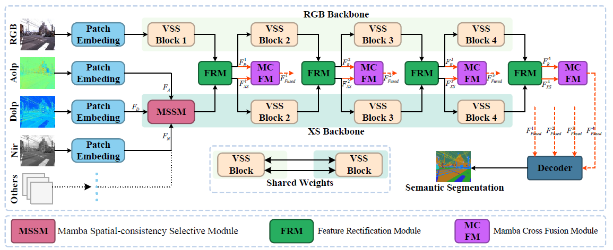

# Mul-VMamba
<div align="center"> 

## Mul-VMamba: Multi-modal semantic segmentation using selection-fusion-based Vision-Mamba

</div>

## Introduction

In traffic driving environments with complex lighting conditions, integrating multi-modal data (RGB, depth, infrared, and so on) can significantly enhance the accuracy of semantic segmentation, thereby providing precise information for downstream tasks such as autonomous driving. However, existing approaches emphasize segmentation accuracy at the expense of efficiency. To address this trade-off, we propose a multi-modal semantic segmentation network based on the linear complexity Selective State Space Model (S6, a.k.a Mamba), dubbed Mul-VMamba. Mul-VMamba establishes selection-fusion relationships among multi-modal features, enabling semantic segmentation with any input modalities. Specifically, the Mamba Spatial-consistency Selective Module (MSSM) adaptively extracts feature mapping relationships and filters out redundant features at the same spatial locations, preserving the spatial relationships between each modality. Additionally, the Mamba Cross-Fusion Module (MCFM) introduces a Cross Selective State Space Model (Cross-S6), establishing the relationship between s6 and multimodal features, achieving optimal fusion performance.

## Network



## Dataset

### Mcubes [Link](https://github.com/kyotovision-public/multimodal-material-segmentation/tree/main)
The Mcubes_dataset should organized in the following format:
```
Mcubes_dataset
├── polL_dolp
│   ├──outscene1208_2_0000000150.npy
│   ├──outscene1208_2_0000000180.npy
    ...
├── polL_color
│   ├──outscene1208_2_0000000150.png
│   ├──outscene1208_2_0000000180.png
    ...
├── polL_aolp_sin
├── polL_aolp_cos
├── list_folder
│   ├──all.txt
│   ├──test.txt
│   ├──train.txt
│   └──val.txt
├── SS
├── SSGT4MS
├── NIR_warped_mask
├── NIR_warped
└── GT
```

### DELIVER [Link](https://github.com/jamycheung/DELIVER)
The DELIVER _dataset should organized in the following format:

```
DELIVER
├── depth
│   ├── cloud
│   │   ├── test
│   │   │   ├── MAP_10_point102
│   │   │   │   ├── 045050_depth_front.png
│   │   │   │   ├── ...
│   │   ├── train
│   │   └── val
│   ├── fog
│   ├── night
│   ├── rain
│   └── sun
├── event
├── hha
├── img
├── lidar
└── semantic
```

## Usage
### Environment

```
python:3.11.5, torch：2.1.2, CUDA: 11.8
```

```
cd semseg/kernels/selective_scan
pip install .
```

```
install others requirement the code required.
```

### Training


Download pre-train [Vmamba-tiny](https://github.com/MzeroMiko/VMamba)


```
cd path/to/Mul-VMamba
conda activate yourenv
export PYTHONPATH="path/to/Mul-VMamba"
python -m torch.distributed.launch --nproc_per_node=4 --use_env tools/train_mm.py --cfg configs/deliver_rgbdelmulmamba.yaml
python -m torch.distributed.launch --nproc_per_node=4 --use_env tools/train_mm.py --cfg configs/mcubes_rgbadnmulmamba.yaml
```

### Evaluation

modify the model path in config.

```
cd path/to/Mul-VMamba
conda activate yourenv
export PYTHONPATH="path/to/Mul-VMamba"
CUDA_VISIBLE_DEVICES=0 python tools/val_mm.py --cfg configs/deliver_rgbdel.yaml
```

## Model Zoo

### DELIVER dataset

| Model-Modal      | mIoU   | weight |
| :--------------- | :----- | :------ |
| Mul-VMamba-RGB-D     | 66.52 | [GoogleDrive](https://drive.google.com/drive/folders/1nrA_aW0dcy8TeLbSKMxNiY1yx_Afenia?usp=drive_link) |
| Mul-VMamba-RGB-D-E   | 67.43 | [GoogleDrive](https://drive.google.com/drive/folders/1nrA_aW0dcy8TeLbSKMxNiY1yx_Afenia?usp=drive_link) |
| Mul-VMamba-RGB-D-E-L | 68.98 | [GoogleDrive](https://drive.google.com/drive/folders/1nrA_aW0dcy8TeLbSKMxNiY1yx_Afenia?usp=drive_link) |

### Mcubes dataset

| Model-Modal      | mIoU   | weight |
| :--------------- | :----- | :------ |
| Mul-VMamba-RGB-A     | 52.48 | [GoogleDrive](https://drive.google.com/drive/folders/1P-9CnmtKYeleyqsuRwpvOguZhIX2w0q6?usp=drive_link) |
| Mul-VMamba-RGB-A-D   | 53.29 | [GoogleDrive](https://drive.google.com/drive/folders/1P-9CnmtKYeleyqsuRwpvOguZhIX2w0q6?usp=drive_link) |
| Mul-VMamba-RGB-A-D-N | 54.65 | [GoogleDrive](https://drive.google.com/drive/folders/1P-9CnmtKYeleyqsuRwpvOguZhIX2w0q6?usp=drive_link) |


